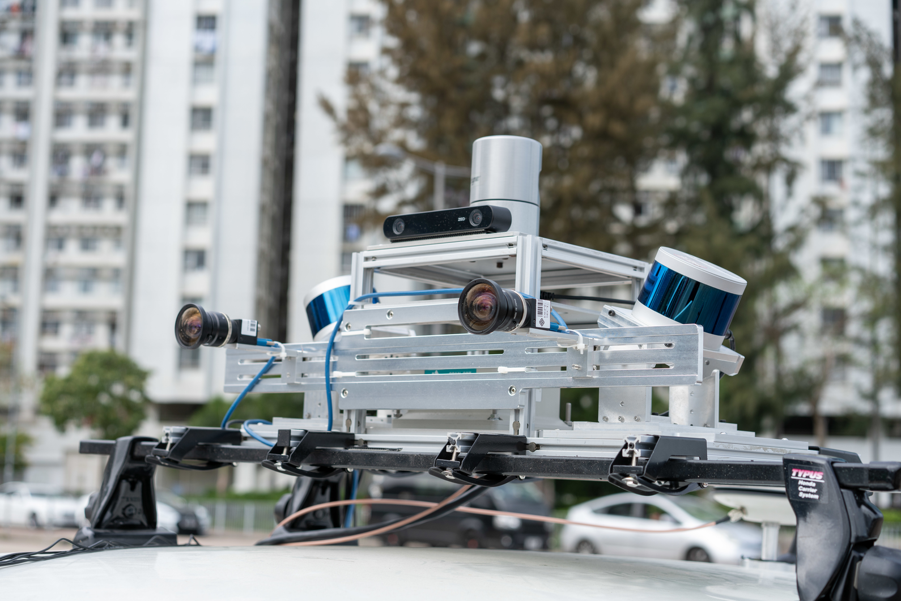
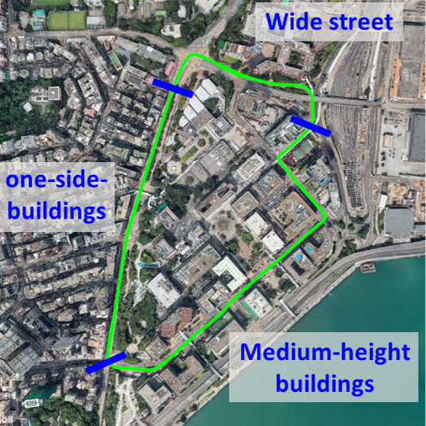
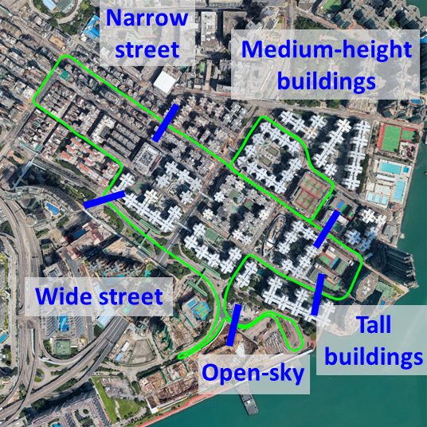
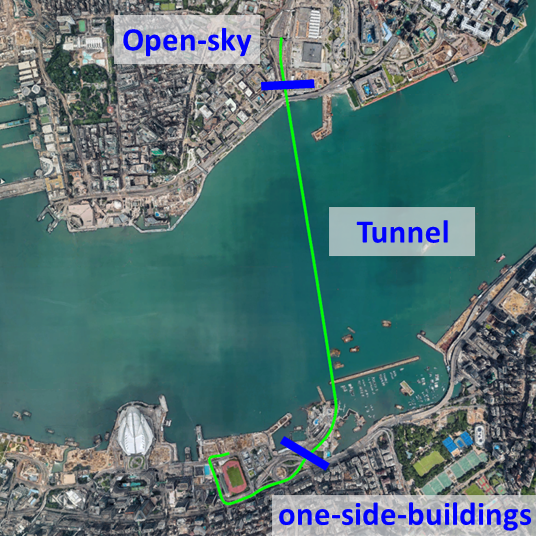
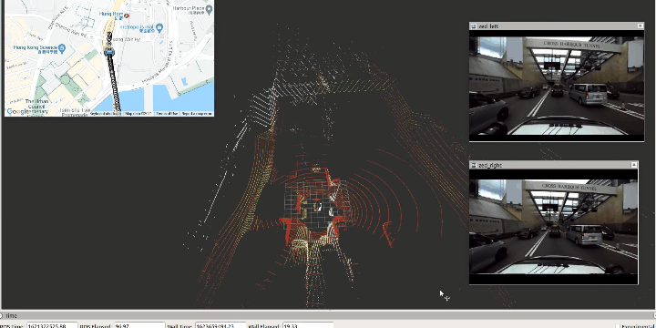

# UrbanNav
### An Open-Sourcing Localization Dataset Collected in Asian Urban Canyons, including Tokyo and Hong Kong

This repository is the usage page of the [UrbanNav dataset](https://www.polyu-ipn-lab.com/download). Positioning and localization in deep urban canyons using low-cost sensors is still a challenging problem. The accuracy of GNSS can be severely challenged in urban canyons due to the high-rising buildings, leading to numerous Non-line-of-sight (NLOS) receptions and multipath effects. Moreover, the excessive dynamic objects can also distort the performance of LiDAR, and camera. The UrbanNav dataset wishes to provide a challenging data source to the community to further accelerate the study of accurate and robust positioning in challenging urban canyons. The dataset includes sensor measurements from GNSS receiver, LiDAR, camera and IMU, together with accurate ground truth from [SPAN-CPT](https://novatel.com/products/span-gnss-inertial-navigation-systems) system. Different from the existing dataset, such as [Waymo](https://waymo.com/open/), [KITTI](http://www.cvlibs.net/datasets/kitti/), UrbanNav provide raw GNSS [RINEX](https://en.wikipedia.org/wiki/RINEX) data. In this case, users can improve the performance of GNSS positioning via raw data. **In short, the UrbanNav dataset pose a special focus on improving GNSS positioning in urban canyons, but also provide sensor measurements from LiDAR, camera and IMU**. If you got any problems when using the dataset and cannot find a satisfactory solution in the issue list, please open a new issue and we will reply ASAP.

Key words: **Positioning**, **Localization**, **GNSS Positioning**, **Urban Canyons**, **GNSS Raw Data**,**Dynamic Objects**, **GNSS/INS/LiDAR/Camera**, **Ground Truth**

<p align="center">
  
</p>

**Important Notes**: 
  - **About access to GNSS RINEX file**: The GNSS measurements is provided as GNSS [RINEX](https://en.wikipedia.org/wiki/RINEX) data. We will recently open-source a package, the [GraphGNSSLib](https://github.com/weisongwen/GraphGNSSLib), which provide easy access to the GNSS RINEX file and publish the data as customized ROS message. Meanwhile, we [GraphGNSSLib](https://github.com/weisongwen/GraphGNSSLib) also provide the capabilities of GNSS positioning and real-time kinematic (RTK) using factor graph optimization (FGO). If you wish to use the GraphGNSSLib, keep an eye on the update of this repo.
  - **Dataset contribution**: Researches who wish to contribute their dataset as part of the UrbanNav dataset, please feel free to contact us via email <darren-f.huang@connect.polyu.hk>, <welson.wen@polyu.edu.hk>, and <lt.hsu@polyu.edu.hk>. We wish the UrbanNav can be a platform for navigation solution development, validation and sharing.
  - **Algorithm validation and contribution**: Researches are welcomed to share their navigation solution results, source code to the UrbanNav dataset after a code review process, e,g, code for GNSS/INS integration or LiDAR SLAM, etc. 

## Overview
- [Objective](#Objective-of-the-Dataset)
- [Hong Kong Dataset](#hong-kong-dataset)
- [Tokyo Dataset](#tokyo-dataset)
- [Getting Started](docs/GETTING_STARTED.md)
- [Acknowledgements](#acknowledgements)
- [License](#license)
- [Related Publications](docs/RELATED_PUBLICATIONS.md)

## Objective of the Dataset

- Open-sourcing positioning sensor data, including GNSS, INS, LiDAR and cameras collected in Asian urban canyons;

- Raising the awareness of the urgent navigation requirement in highly-urbanized areas, especially in Asian-Pacific regions;

- Providing an integrated online platform for data sharing to facilitate the development of navigation solutions of the research community; and 

- Benchmarking positioning algorithms based on the open-sourcing data.

**Contact Authors (corresponding to issues and maintenance of the currently available Hong Kong dataset)**: [Li-Ta Hsu](https://www.polyu.edu.hk/aae/people/academic-staff/dr-lt-hsu/), [Weisong Wen](https://www.polyu.edu.hk/aae/people/academic-staff/dr-weisong-wen/), [Feng Huang](https://www.polyu-ipn-lab.com/people), [Hoi-Fung Ng](https://www.polyu-ipn-lab.com/people), [GuoHao Zhang](https://www.polyu-ipn-lab.com/people), [Xiwei Bai](https://www.polyu-ipn-lab.com/people) from the [Intelligent Positioning and Navigation Laboratory](https://www.polyu-ipn-lab.com/), The Hong Kong Polytechnique University

**Related Papers:** 
  - Hsu, Li-Ta, Kubo, Nobuaki, Wen, Weisong, Chen, Wu, Liu, Zhizhao, Suzuki, Taro, Meguro, Junichi, "UrbanNav:An Open-Sourced Multisensory Dataset for Benchmarking Positioning Algorithms Designed for Urban Areas," Proceedings of the 34th International Technical Meeting of the Satellite Division of The Institute of Navigation (ION GNSS+ 2021), St. Louis, Missouri, September 2021, pp. 226-256.
https://doi.org/10.33012/2021.17895

## Hong Kong Dataset
### **Sensor Setups**
The platform for data collection in Hong Kong is a Honda Fit. The platform is equipped with the following sensors:
  - 3D LiDAR sensor: ([HDL 32E Velodyne](https://velodynelidar.com/products/hdl-32e/)): (360 HFOV, +10~-30 VFOV, 80m range, 10Hz)，
  - Slant lidars: [VLP16 Velodyne](https://velodynelidar.com/products/puck/), [Lslidar C16](http://wiki.ros.org/lslidar_c16)
  - IMU ([Xsens Mti 10](https://www.xsens.com/products/mti-10-series), 400 Hz, AHRS)
  - GNSS receivers(x3): u-blox ZED-F9P(x2), EVK-M8T(x1)(1 Hz)
  - NovAtel Flexpak6 (1 Hz)
  - Camera: [ZED2](https://www.stereolabs.com/zed-2/) Stereo (15 Hz)
  - [SPAN-CPT](https://www.novatel.com/products/span-gnss-inertial-systems/span-combined-systems/span-cpt/): (RTK GNSS/INS, RMSE: 5cm, 1Hz) 

<p align="center">
  
</p>
<p align="center">
  
</p>

### DataSets
|                                    |  Total Size |Path length | Sensors |Urban Canyon | Download  | 3D PointCloud |
|------------------------------------|----------:|:-------:|:-------:|:-------:|:-------:|:---------:|
| [UrbanNav-HK-Medium-Urban-1](#urbannav-hk-medium-urban-1)        | 33.7 GB (785s)  | 3.64 Km | LiDARs/Stereo Camera/IMU/GNSS | Medium |[ROS](https://www.dropbox.com/s/mit5v1yo8pzh9xq/UrbanNav-HK_TST-20210517_sensors.bag?dl=0), [GNSS](https://www.dropbox.com/sh/2haoy68xekg95zl/AAAkcN4FwhFxkPY1lXsxbJrxa?dl=0), [IMU](https://www.dropbox.com/sh/trwho92zknvisw7/AADBnjnX9p59MM73YaEzCzCZa?dl=0), [Ground Truth](https://www.dropbox.com/s/twsvwftucoytfpc/UrbanNav_TST_GT_raw.txt?dl=0), [Skymask](https://www.dropbox.com/s/34xqa1jmmbjkldc/UrbanNav-HK-Medium-Urban-TSTE.csv?dl=0)| [Medium Urban Map](http://13.250.107.205/examples/urbannav/tst/) | 
| [UrbanNav-HK-Deep-Urban-1](#urbannav-hk-deep-urban-1)   | 63.9 GB (1536s) | 4.51 Km | LiDARs/Stereo Camera/IMU/GNSS| Deep |[ROS](https://www.dropbox.com/s/1g3dllvdrgihkij/UrbanNav-HK_Whampoa-20210521_sensors.bag?dl=0), [GNSS](https://www.dropbox.com/sh/7ox7718bzcjqtlf/AABH_Kjm65gHQ09K3antBRdua?dl=0), [IMU](https://www.dropbox.com/sh/bm1wuykre2tdecf/AAB9iAbnRSur2MF9SvS88W9ga?dl=0), [Ground Truth](https://www.dropbox.com/s/ej2mkue2w3r36s2/UrbanNav_whampoa_raw.txt?dl=0), [Skymask](https://www.dropbox.com/s/m1k5w1y80ebniul/UrbanNav-HK-Deep-Urban-WP.csv?dl=0)| [Deep Urban Map](http://13.250.107.205/examples/urbannav/whampoa/) |
| [UrbanNav-HK-Harsh-Urban-1](#urbannav-hk-harsh-urban-1)   | 147 GB (3367s)  | 4.86 Km | LiDARs/Stereo Camera/IMU/GNSS | Harsh |[ROS](https://www.dropbox.com/s/wlkzxae2aob0bnv/UrbanNav-HK_Mongkok-20210518_sensors.bag?dl=0), [GNSS](https://www.dropbox.com/sh/xej1cxv3a0erffc/AADfhRODJk__Z49WC1R0Nw5ea?dl=0), [IMU](https://www.dropbox.com/sh/67thb09175jfkn3/AACEEhRmSwMI_Q3q7gX0o1F9a?dl=0), [Ground Truth](https://www.dropbox.com/s/yaexvwppb6k3szp/UrbanNav_mongkok_GT_part_raw.txt?dl=0), [Skymask](https://www.dropbox.com/s/ewbu2sjzzed24jq/UrbanNav-HK-Harsh-Urban-MK.csv?dl=0) | [Harsh Urban Map](http://13.250.107.205/examples/urbannav/mongkok/) |
| [UrbanNav-HK-Tunnel-1](#urbannav-hk-tunnel-1)  | 17 GB (398s)    | 3.15 Km | LiDARs/Stereo Camera/IMU/GNSS  | N/A |[ROS](https://www.dropbox.com/s/8vwkero6boujtzb/UrbanNav-HK_CHTunnel-20210518_sensors.bag?dl=0), [GNSS](https://www.dropbox.com/sh/9new5uwl7f9d2c9/AAAdisSwBOOi40Vf3r5PGtSCa?dl=0), [IMU](https://www.dropbox.com/sh/f3gg9e80hns5fsi/AADL3kSKUadOpPrmJ7_JJFvda?dl=0), [Ground Truth](https://www.dropbox.com/s/fqsviiei3r5tu6r/UrbanNav_tunnel_GT_raw.txt?dl=0) | [Tunnel map](http://13.250.107.205/examples/urbannav/tunnel/) | 
| [(Pilot data) UrbanNav-HK-Data20190428](#urbannav-hk-data20190428)            | 42.9 GB (487s)  | 2.01 Km | LiDAR/Camera/IMU/GNSS | Medium |[ROS](https://www.dropbox.com/s/pfjvauvletdpnh2/2019-04-28-20-58-02.bag?dl=0), [GNSS](https://www.dropbox.com/s/25dsnx27wu8zgew/GNSS%20RINEX%20UrbanNav-HK-Data20190428.tar.gz?dl=0) | N/A|
| [(Pilot data) UrbanNav-HK-Data20200314](#urbannav-hk-data20200314)             |27.0 GB (300s)  | 1.21 Km | LiDAR/Camera/IMU/GNSS  | Light |[ROS](https://www.dropbox.com/s/3mtlncglrv7p39l/2020-03-14-16-45-35.bag.tar.gz?dl=0), [GNSS](https://www.dropbox.com/sh/22mnpg86umjb4zh/AAAsIiQ1WAMp20OROUn4h6pka?dl=0) | N/A |


#### UrbanNav-HK-Medium-Urban-1

Dataset UrbanNav-HK-Medium-Urban-1 is collected in a typical urban canyon of Hong Kong near [TST](https://goo.gl/maps/Sjt5WadnVEnzj6XU6)  which involves high-rising buildings, numerous dynamic objects. A updated version to UrbanNav-HK-Data20190428, two loops included. The coordinates transformation between multiple sensors, and intrinsic measurements of camera can be found via [Extrinsic Parameters](UrbanNav-HK-Medium-Urban-1/extrinsic.yaml), [IMU Nosie](UrbanNav-HK-Medium-Urban-1/xsens_imu_param.yaml) and [Intrinsic Parameters of Camera](UrbanNav-HK-Medium-Urban-1/zed2_intrinsics.yaml).
- [Demo Video](https://www.dropbox.com/s/a4puf31ulksrfiu/1.tst_x5.mkv?dl=0), [Sky-pointing Camera Video](https://www.dropbox.com/s/mol3w6hisxj8wiy/demo1_medium-Sky-pointing%20camera.mp4?dl=0)
- [ROS](https://www.dropbox.com/s/mit5v1yo8pzh9xq/UrbanNav-HK_TST-20210517_sensors.bag?dl=0)
  - ROSBAG file which includes:
    - 3D LiDAR point clouds ([sensor_msgs/PointCloud2](https://docs.ros.org/en/api/sensor_msgs/html/msg/PointCloud2.html)): ```/velodyne_points```
    - Slant lidars ([sensor_msgs/PointCloud2](https://docs.ros.org/en/api/sensor_msgs/html/msg/PointCloud2.html)): ```/left/lslidar_point_cloud``` ```/right/velodyne_points``` 
    - Stereo Camera ([sensor_msgs/Image](https://docs.ros.org/en/melodic/api/sensor_msgs/html/msg/Image.html)): ```/zed2/camera/left/image_raw``` ```/zed2/camera/right/image_raw```
    - IMU ([sensor_msgs/Imu](http://docs.ros.org/en/melodic/api/sensor_msgs/html/msg/Imu.html)): ```/imu/data```
    - SPAN-CPT after IE post-processing ([novatel_msgs/INSPVAX](http://docs.ros.org/en/jade/api/novatel_msgs/html/msg/INSPVAX.html)): ```/novatel_data/inspvax```
    - Time Reference between latest NMEA and ROS time ([sensor_msgs/TimeReference](http://docs.ros.org/en/melodic/api/sensor_msgs/html/msg/TimeReference.html)): ```/time_reference```
- [GNSS](https://www.dropbox.com/sh/2haoy68xekg95zl/AAAkcN4FwhFxkPY1lXsxbJrxa?dl=0) (RINEX v3.02)
  - GNSS RINEX files, to use it, we suggest to use the [RTKLIB](http://www.rtklib.com/)
  - Known issue： One of the GNSS receivers (F9P) have a malfunction in a certain  period (details refer to [issue#11](https://github.com/IPNL-POLYU/UrbanNavDataset/issues/11), please use another GNSS receiver in that period instead) 
- [IMU](hhttps://www.dropbox.com/s/2rh1rs15ihpf63u/xsense_imu_medium_urban1.csv?dl=0), Xsens MTi 10, 400Hz; [Phone IMU](https://www.dropbox.com/s/x3l4wzug634qhrw/phone_imu_medium_urban1.csv?dl=0), Xiaomi 8, 239Hz
   - IMU data for **non-ROS users**.
- [Ground Truth](https://www.dropbox.com/s/twsvwftucoytfpc/UrbanNav_TST_GT_raw.txt?dl=0), NovAtel SPAN-CPT + IE, 1Hz 
##### For mainland china users, please download the dataset using the **Baidu Clouds Links**
- Download by Baidu Cloud Link: 
  - [UrbanNav-HK-Medium-Urban-1](https://pan.baidu.com/s/1My8WziJvOJymHx9r5N9AVg) (ROS)  (cg95)


<p align="center">
  
</p>

<p align="center">
  
</p>

#### UrbanNav-HK-Deep-Urban-1
Dataset UrbanNav-HK-Deep-Urban-1 is collected in a [highly urbanized area](https://goo.gl/maps/6MNJwLhJomz6sf2q6) of Hong Kong which involves dense traffic, small tunnels and loops. The coordinates transformation between multiple sensors, and intrinsic measurements of camera can be found via [Extrinsic Parameters](UrbanNav-HK-Deep-Urban-1/extrinsic.yaml), [IMU Nosie](UrbanNav-HK-Deep-Urban-1/xsens_imu_param.yaml) and [Intrinsic Parameters of Camera](UrbanNav-HK-Deep-Urban-1/zed2_intrinsics.yaml).
- [Demo Video](https://www.dropbox.com/s/5yi2hmigzqr0pr8/2.whampoa_x5.mkv?dl=0), [Sky-pointing Camera Video](https://www.dropbox.com/s/q2rueti4dd6i163/demo2_deep-Sky-pointing%20camera.mp4?dl=0)
- [ROS](https://www.dropbox.com/s/1g3dllvdrgihkij/UrbanNav-HK_Whampoa-20210521_sensors.bag?dl=0)  
  - ROSBAG file which includes:
    - 3D LiDAR point clouds ([sensor_msgs/PointCloud2](https://docs.ros.org/en/api/sensor_msgs/html/msg/PointCloud2.html)): ```/velodyne_points```
    - Slant lidars ([sensor_msgs/PointCloud2](https://docs.ros.org/en/api/sensor_msgs/html/msg/PointCloud2.html)): ```/left/lslidar_point_cloud``` ```/right/velodyne_points``` 
    - Stereo Camera ([sensor_msgs/Image](https://docs.ros.org/en/melodic/api/sensor_msgs/html/msg/Image.html)): ```/zed2/camera/left/image_raw``` ```/zed2/camera/right/image_raw```
    - IMU ([sensor_msgs/Imu](http://docs.ros.org/en/melodic/api/sensor_msgs/html/msg/Imu.html)): ```/imu/data```
    - SPAN-CPT after IE post-processing ([novatel_msgs/INSPVAX](http://docs.ros.org/en/jade/api/novatel_msgs/html/msg/INSPVAX.html)): ```/novatel_data/inspvax```
    - Time Reference between latest NMEA and ROS time ([sensor_msgs/TimeReference](http://docs.ros.org/en/melodic/api/sensor_msgs/html/msg/TimeReference.html)): ```/time_reference```
- [GNSS](https://www.dropbox.com/sh/7ox7718bzcjqtlf/AABH_Kjm65gHQ09K3antBRdua?dl=0) (RINEX v3.02)
  - GNSS RINEX files, to use it, we suggest to use the [RTKLIB](http://www.rtklib.com/)
- [IMU](https://www.dropbox.com/s/pet3up4vka61jop/xsense_imu_deep_urban1.csv?dl=0), Xsens MTi 10, 400Hz; [Phone IMU](https://www.dropbox.com/s/f7429q3yb09uwza/phone_imu_deep_urban1.csv?dl=0), Xiaomi 8, 239Hz
- [Ground Truth](https://www.dropbox.com/s/ej2mkue2w3r36s2/UrbanNav_whampoa_raw.txt?dl=0)， NovAtel SPAN-CPT + IE, 1Hz 
##### For mainland china users, please download the dataset using the **Baidu Clouds Links**
- Download by Baidu Cloud Link: 
  - [UrbanNav-HK-Deep-Urban-1](https://pan.baidu.com/s/1MZh2VsrValTMqzLweRs8pg) (ROS)  (jnsa)

<p align="center">
  
</p>

<p align="center">
  
</p>

#### UrbanNav-HK-Harsh-Urban-1
Dataset UrbanNav-HK-Harsh-Urban-1 is collected in an [ultra-dense urban canyon](https://goo.gl/maps/YRgizi16z6aNvhi88) of Hong Kong which involves dense vehicles, pedestrians and loops. The coordinates transformation between multiple sensors, and intrinsic measurements of camera can be found via [Extrinsic Parameters](UrbanNav-HK-Harsh-Urban-1/extrinsic.yaml), [IMU Nosie](UrbanNav-HK-Harsh-Urban-1/xsens_imu_param.yaml) and [Intrinsic Parameters of Camera](UrbanNav-HK-Harsh-Urban-1/zed2_intrinsics.yaml).
- [Demo Video](https://www.dropbox.com/s/7t29m6tqkzefdx2/3.mongkok_x5.mp4?dl=0), [Sky-pointing Camera Video](https://www.dropbox.com/s/949m1y01gkk3q19/demo3_harsh-Sky-pointing%20camera.mp4?dl=0)
- [ROS](https://www.dropbox.com/s/wlkzxae2aob0bnv/UrbanNav-HK_Mongkok-20210518_sensors.bag?dl=0)  
  - ROSBAG file which include (note: In this dataset, GT is provided as a file but not append into rosbag):
    - 3D LiDAR point clouds ([sensor_msgs/PointCloud2](https://docs.ros.org/en/api/sensor_msgs/html/msg/PointCloud2.html)): ```/velodyne_points```
    - Slant lidars ([sensor_msgs/PointCloud2](https://docs.ros.org/en/api/sensor_msgs/html/msg/PointCloud2.html)): ```/left/lslidar_point_cloud``` ```/right/velodyne_points``` 
    - Stereo Camera ([sensor_msgs/Image](https://docs.ros.org/en/melodic/api/sensor_msgs/html/msg/Image.html)): ```/zed2/camera/left/image_raw``` ```/zed2/camera/right/image_raw```
    - IMU ([sensor_msgs/Imu](http://docs.ros.org/en/melodic/api/sensor_msgs/html/msg/Imu.html)): ```/imu/data```
    - Time Reference between latest NMEA and ROS time ([sensor_msgs/TimeReference](http://docs.ros.org/en/melodic/api/sensor_msgs/html/msg/TimeReference.html)): ```/time_reference```
    - _Note_: Only part of GT is verified for this dataset thus not appended into this rosbag. For data consistency, a part of the rosbag with GT is provided here: [ROS_part](https://www.dropbox.com/s/ee4fw96cdewebd0/UrbanNav-HK_Mongkok-20210518_sensors_part.bag?dl=0)
- [GNSS](https://www.dropbox.com/sh/xej1cxv3a0erffc/AADfhRODJk__Z49WC1R0Nw5ea?dl=0) (RINEX v3.02)
  - GNSS RINEX files, to use it, we suggest to use the [RTKLIB](http://www.rtklib.com/)
- [IMU](https://www.dropbox.com/s/krga65ny72otgxi/xsense_imu_harsh_1.csv?dl=0), Xsens MTi 10, 400Hz; [Phone IMU](https://www.dropbox.com/s/g26p5oinm8vi0ok/phone_imu_harsh_1.csv?dl=0), Xiaomi 8, 239Hz
- [Ground Truth](https://www.dropbox.com/s/zqmxgf59bp7en6c/UrbanNav_mongkok_GT_part_raw.txt?dl=0)， NovAtel SPAN-CPT + IE, 1Hz 
##### For mainland china users, please download the dataset using the **Baidu Clouds Links**
- Download by Baidu Cloud Link: 
  - [UrbanNav-HK-Harsh-Urban-1](https://pan.baidu.com/s/16pHxF4XcbhMUXMDd2xggyQ) (ROS)  (2q4j)

<p align="center">
  
</p>

<p align="center">
  
</p>

#### UrbanNav-HK-Tunnel-1
UrbanNav-HK-Tunnel-1 is collected in a [sea tunnel](https://goo.gl/maps/eaMvfPZ4EeXxDuoL6) of Hong Kong which involves dense vehicles and GNSS signal losses. The coordinates transformation between multiple sensors, and intrinsic measurements of camera can be found via [Extrinsic Parameters](UrbanNav-HK-Tunnel-1/extrinsic.yaml), [IMU Nosie](UrbanNav-HK-Tunnel-1/xsens_imu_param.yaml) and [Intrinsic Parameters of Camera](UrbanNav-HK-Tunnel-1/zed2_intrinsics.yaml).

- [Demo Video](https://www.dropbox.com/s/tcc4cfx2mgttsdc/4.tunnel_x5.mkv?dl=0)
- [ROS](https://www.dropbox.com/s/8vwkero6boujtzb/UrbanNav-HK_CHTunnel-20210518_sensors.bag?dl=0)  
  - ROSBAG file which includes:
    - 3D LiDAR point clouds ([sensor_msgs/PointCloud2](https://docs.ros.org/en/api/sensor_msgs/html/msg/PointCloud2.html)): ```/velodyne_points```
    - Slant lidars ([sensor_msgs/PointCloud2](https://docs.ros.org/en/api/sensor_msgs/html/msg/PointCloud2.html)): ```/left/lslidar_point_cloud``` ```/right/velodyne_points``` 
    - Stereo Camera ([sensor_msgs/Image](https://docs.ros.org/en/melodic/api/sensor_msgs/html/msg/Image.html)): ```/zed2/camera/left/image_raw``` ```/zed2/camera/right/image_raw```
    - IMU: ([sensor_msgs/Imu](http://docs.ros.org/en/melodic/api/sensor_msgs/html/msg/Imu.html)): ```/imu/data```
    - SPAN-CPT after IE post-processing ([novatel_msgs/INSPVAX](http://docs.ros.org/en/jade/api/novatel_msgs/html/msg/INSPVAX.html)): ```/novatel_data/inspvax```
    - Time Reference between latest NMEA and ROS time ([sensor_msgs/TimeReference](http://docs.ros.org/en/melodic/api/sensor_msgs/html/msg/TimeReference.html)): ```/time_reference```
- [GNSS](https://www.dropbox.com/sh/9new5uwl7f9d2c9/AAAdisSwBOOi40Vf3r5PGtSCa?dl=0) (RINEX v3.02)
  - GNSS RINEX files, to use it, we suggest to use the [RTKLIB](http://www.rtklib.com/)
- [IMU](https://www.dropbox.com/s/1aql7o1w4sf7j6o/xsense_imu_tunnel_1.csv?dl=0), Xsens MTi 10, 400Hz; [Phone IMU](https://www.dropbox.com/s/ya1rpik6lzsmgsn/phone_imu_tunnel_1.csv?dl=0), Xiaomi 8, 239Hz
- [Ground Truth](https://www.dropbox.com/s/fqsviiei3r5tu6r/UrbanNav_tunnel_GT_raw.txt?dl=0)， NovAtel SPAN-CPT + IE, 1Hz  
##### For mainland china users, please download the dataset using the **Baidu Clouds Links**
- Download by Baidu Cloud Link: 
  - [UrbanNav-HK-Tunnel-1](https://pan.baidu.com/s/1rLhtqZxygmGe1oWZSwN9cg) (ROS)  (aj47)

<p align="center">
  
</p>

<p align="center">
  
</p>

#### UrbanNav-HK-Data20190428
**Brief**: Dataset UrbanNav-HK-Data20190428 is collected in a typical urban canyon of Hong Kong near TST which involves high-rising buildings, numerous dynamic objects. The coordinates transformation between multiple sensors, and intrinsic measurements of camera can be found via [Extrinsic Parameters](UrbanNav-HK-Data20190428/extrinsic.yaml), [IMU Nosie](UrbanNav-HK-Data20190428/xsens_imu_param.yaml) and [Intrinsic Parameters of Camera](UrbanNav-HK-Data20190428/camera_extrinsic.yaml).

Some key features are as follows:
  | Date of Collection | Total Size |Path length |Sensors |
  | :---:  | :---:  |:---:  |:---:  |
  | 2019/04/28 | 42.9 GB|2.01 Km |GNSS/LiDAR/Camera/IMU/SPAN-CPT |

- Download by Dropbox Link: [Data INFO](https://www.dropbox.com/s/u8jise47l01g19v/Data%20Info%20Dropbox.zip?dl=0)
  - [UrbanNav-HK-Data20190428](https://www.dropbox.com/s/pfjvauvletdpnh2/2019-04-28-20-58-02.bag?dl=0) (ROS)
    - ROSBAG file which includes:
      - GNSS positioning (solution directly from GNSS receiver): ```/ublox_node/fix```
      - 3D LiDAR point clouds: ```/velodyne_points```
      - Camera: ```/camera/image_color```
      - IMU: ```/imu/data```
      - SPAN-CPT: ```/novatel_data/inspvax```
  - [GNSS](https://www.dropbox.com/s/25dsnx27wu8zgew/GNSS%20RINEX%20UrbanNav-HK-Data20190428.tar.gz?dl=0) (RINEX)
    - GNSS RINEX files, to use it, we suggest to use the [RTKLIB](http://www.rtklib.com/)
  - [IMU/SPAN-CPT](https://www.dropbox.com/s/g1xt89py1j0uea1/IMU-Reference%20UrbanNav-HK-Data20190428.zip?dl=0) (CSV)
    - IMU and SPAN-CPT data for **non-ROS users**.

For mainland china users, please download the dataset using the **Baidu Clouds Links**
- Download by Baidu Cloud Link: [Data INFO](https://pan.baidu.com/s/1QeeJMZutOtZBK0wXnVKM3Q), (qm3l)
  - [UrbanNav-HK-Data20190428](https://pan.baidu.com/s/1ieaSk9MPBgSvfuJhHTbDjQ) (ROS)  (nff4)
    - ROSBAG file whihc includes:
        - GNSS positioning (solution directly from GNSS receiver): ```/ublox_node/fix```
        - 3D LiDAR point clouds: ```/velodyne_points```
        - Camera: ```/camera/image_color```
        - IMU: ```/imu/data```
        - SPAN-CPT: ```/novatel_data/inspvax```
  - [GNSS (RINEX)](https://pan.baidu.com/s/1VEhmaf56R4cKeoUpZBrOug) (gojb)
    - GNSS RINEX files, to use it, we suggest to use the [RTKLIB](http://www.rtklib.com/)
  - [IMU/SPAN-CPT](https://pan.baidu.com/s/12gMv9EXt5Rpqu_14xcIaVw) (CSV) (k3dz)
    - IMU and SPAN-CPT data for **non-ROS users**.

<p align="center">
  
</p>

#### UrbanNav-HK-Data20200314
**Brief**: Dataset UrbanNav-HK-Data2020314 is collected in a low-urbanization area in Kowloon which suitable for algorithmic verification and comparison. The coordinates transformation between multiple sensors, and intrinsic measurements of camera can be found via [Extrinsic Parameters](UrbanNav-HK-Data20200314/extrinsic.yaml), [IMU Nosie](UrbanNav-HK-Data20200314/xsens_imu_param.yaml) and [Intrinsic Parameters of Camera](UrbanNav-HK-Data20200314/camera_extrinsic.yaml).

Some key features are as follows:
  | Date of Collection | Total Size |Path length |Sensors |
  | :---:  | :---:  |:---:  |:---:  |
  | 2020/03/14 | 27.0 GB|1.21 Km |LiDAR/Camera/IMU/SPAN-CPT |

- Download by Dropbox Link: 
  - [UrbanNav-HK-Data20200314](https://www.dropbox.com/s/3mtlncglrv7p39l/2020-03-14-16-45-35.bag.tar.gz?dl=0) (ROS)
    - ROSBAG file which includes:
      - 3D LiDAR point clouds: ```/velodyne_points```
      - Camera: ```/camera/image_color```
      - IMU: ```/imu/data```
      - SPAN-CPT: ```/novatel_data/inspvax```
  - [GNSS](https://www.dropbox.com/sh/22mnpg86umjb4zh/AAAsIiQ1WAMp20OROUn4h6pka?dl=0) (RINEX)
    - GNSS RINEX files, to use it, we suggest to use the [RTKLIB](http://www.rtklib.com/)

For mainland china users, please download the dataset using the **Baidu Clouds Links**
- Download by Baidu Cloud Link:
  - [UrbanNav-HK-Data20200314](https://pan.baidu.com/s/1MxIZFUjmDtU0luJ7fOXz2w) (ROS)  (n71w)
    - ROSBAG file whihc includes:
        - 3D LiDAR point clouds: ```/velodyne_points```
        - Camera: ```/camera/image_color```
        - IMU: ```/imu/data```
        - SPAN-CPT: ```/novatel_data/inspvax```
  - [GNSS](https://pan.baidu.com/s/1tybs95h3Iz5IjMGw5zJlkQ) (z8vw) (RINEX)
      - GNSS RINEX files, to use it, we suggest to use the [RTKLIB](http://www.rtklib.com/)

<p align="center">
  
</p>


## Tokyo Dataset
### **Sensor Setups**
The platform for data collection in Tokyo is a Toyota Rush. The platform is equipped with the following sensors:
  - 3D LiDAR sensor ([VLP-32C Velodyne](https://velodynelidar.com/products/ultra-puck/)): (360 HFOV, +15~-25 VFOV, 200m range, 10Hz) 
  - GNSS receiver: [u-blox F9P](https://www.u-blox.com/en/product/zed-f9p-module) (5 Hz) and [Trimble NetR9](https://trl.trimble.com/docushare/dsweb/Get/Document-689228/022506-128J_NetR9_DS_USL_0517_LR.pdf) (10 Hz)
  - IMU ([Tamagawa-seiki TAG264](http://www.taroz.net/data/1674N7EJ.pdf), 50 Hz)
  - Ground truth [Applanix POS LV620](https://www.applanix.com/downloads/products/specs/POS-LV-Datasheet.pdf):(RTK GNSS/INS, RMSE: 5cm, 10Hz) 


<p align="center">
  
</p>

### Dataset 1: UrbanNav-TK-20181219
#### Important Notes: the LiDAR calibration file for the LiDAR sensor, extrinsic parameters between sensors are not available now. If you wish to study the GNSS/LiDAR/IMU integration, we suggest using the dataset above collected in Hong Kong. However, the GNSS dataset from Tokyo is challenging which is collected in challenging urban canyons!

  | Date of Collection | Total Size |Path length |Sensors |
  | :---:  | :---:  |:---:  |:---:  |
  | 2018/12/19 | 4.14 GB|>10 Km |GNSS/LiDAR/IMU/Ground Truth |

  - Download by [Dropbox Link](https://www.dropbox.com/s/isu1bugpgr8dpas/Tokyo_Data.zip?dl=0): 
For mainland china users, please download the dataset using the **Baidu Clouds Links**. [Baidu Clouds Links](https://pan.baidu.com/s/1SVhRnD6yigzizqSUfifw1A) (7xpo)
- The dataset contains data from two runs, ```/Odaiba``` and ```/Shinjuku ```.
- The following files are included in each dataset.
  - ```rover_ublox.obs``` and ```rover_trimble.obs```: Rover GNSS RINEX files (5 Hz / 10 Hz)
  - ```imu.csv```: CSV file which includes GPS time, Angular velocity, and acceleration, (50 Hz)
  - ```lidar.bag```: ROSBAG file which includes LiDAR data ```/velodyne_packets```
  - ```base_trimble.obs``` and ```base.nav```: GNSS RINEX files of base station (1 Hz)
  - ```reference.csv```: Ground truth from Applanix POS LV620 (10 Hz)

- The travel trajectory of ```/Odaiba```
<p align="center">
  
</p>

- The travel trajectory of ```/Shinjuku```
<p align="center">
  
</p>


## Acknowledgements
We acknowledge the help from Yihan Zhong, Jiachen Zhang, Yin-chiu Kan, Weichang Xu and Song Yang.

## License
For any technical issues, please contact Feng Huang via email <darren-f.huang@connect.polyu.hk> and [Weisong Wen](https://www.polyu.edu.hk/aae/people/academic-staff/dr-weisong-wen/) via email <welson.wen@polyu.edu.hk>. For collaboration inquiries, please contact [Li-Ta Hsu](https://www.polyu.edu.hk/aae/people/academic-staff/dr-lt-hsu/) via email <lt.hsu@polyu.edu.hk>.

