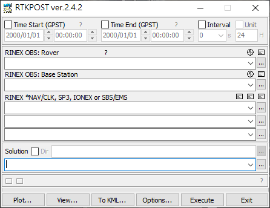

# Getting Started
## GNSS ([Video](https://www.dropbox.com/s/29o0duvhesodwwq/tutorial%20-%20gnss%20using%20UrbanNav.mp4?dl=0))
Data preparation，
- Download the RINEX observation &lt;Date&gt;\.&lt;scenario&gt;\.&lt;place&gt;\.&lt;receiver&gt;\.obs
- Download the Ephemeris data, e.g. [SatRef](https://www.geodetic.gov.hk/en/rinex/downv.aspx) from Hong Kong Lands Department 


Using GNSS library for post-processing and evaluation
- Opensource GNSS evaluation tools: GUI, C++: [RTKLIB](http://www.rtklib.com/), MATLAB: [goGPS](https://github.com/goGPS-Project/goGPS_MATLAB)




## Visual Inertial Odometry ([Video](https://www.dropbox.com/s/b0pcvmxjf9f7gog/tutorial%20-%20visual_inerial%20using%20UrbanNav.mp4?dl=0))
Data preparation,
- Download the bag file;
- Clone the [VINS-Fusion](https://github.com/HKUST-Aerial-Robotics/VINS-Fusion) repository from GitHub;
- Update camera intrinsics and extrinsics in the yaml file;
- Run the framework of VINS-Fusion:
```
roslaunch vins vins_rviz.launch
rosrun vins vins_node ~/catkin_ws/src/VINS-Fusion/config/vi_car/vi_car.yaml
rosbag play DATASET.bag
```
Also can refer to our evaluation result: https://github.com/baaixw/VINS-Fusion-for-UrbanNavDataset-Evaluation

## LiDAR Inertial Odometry ([Video](https://www.dropbox.com/s/1zyqgaygpziq359/tutorial%20-%20lidar_inerial_using%20UrbanNav.mp4?dl=0))
- Take scenario (a) as an example
Download the rosbag [UrbanNav-HK-Medium-Urban-1](https://www.dropbox.com/s/mit5v1yo8pzh9xq/UrbanNav-HK_TST-20210517_sensors.bag?dl=0)


- Prepared the [fine-tune LIO-SAM](https://www.dropbox.com/s/ma0juab5kk780b9/LIO-SAM_for_urban.zip?dl=0) based on the intrinsic and extrinsic. The origianl LIO-SAM can be found at [LIO-SAM](https://github.com/TixiaoShan/LIO-SAM)
```
roslaunch lio_sam run_velodyne.launch
```
- Replay the Rosbag
```
rosbag play UrbanNav-HK_TST-20210517_sensors.bag
```


## Time Synchronization between GPS time and ROS time
We use [Chrony](https://chrony.tuxfamily.org/)+[GPSd](https://gpsd.gitlab.io/gpsd/) to receive the NMEA+PPS signal from Ublox M8T to synchronize ROS computer with GPS time.
[GPS time](https://timetoolsltd.com/gps/what-is-gps-time/): It consists of a count of weeks and seconds of the week since 0 hours (midnight) Sunday 6 January 1980.
ROS time: unix epoch time. The Unix epoch is 00:00:00 UTC on 1 January 1970

GPS-UTC offset is 18 leap seconds for data collected in May 2021. Let's use an example to convert the GPS time to ROS time. 
Assuming the GPS Time is week: 2158 and seconds: 95593, the total seconds is 2158 * 604800(seconds_in_week) + 95593 = 1305253993, then we add 315964800 seconds offset between the origin of GPS time and ROS time. Finally we can get the corresponding UTC time 1621218775 (1305253993 + 315964800 -18 = 1621218775) considering 18 leap seconds.

An example of matlab code to convert gps time to utc time is provided as below,
```
function utctime = gps2utc(gps_week, gps_seconds)
    SECONDS_IN_GPS_WEEK = 604800.0; 
    utctime = (gps_week * SECONDS_IN_GPS_WEEK + gps_seconds-18) + 315964800  ; % 18 leap seconds
end
```
