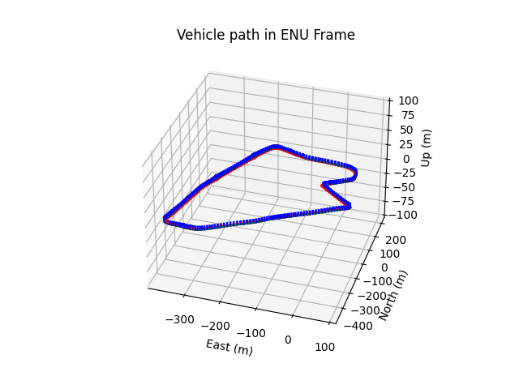

# useful tools


## Read and Visualize the Ground Truth
The script loads all SPANCPT Ground True data and converts them to ENU frame or LiDAR local frame (set convert_body_frame = True) with the first line as origin. 

```bash
pip3 install numpy-quaternion matplotlib pymap3d

python3 run_vehicle_path.py 
```

<p align="center">
  
</p>

## Acknowledgements
We make reference to the code from cadc_devkit(https://github.com/mpitropov/cadc_devkit)

## Known Issues
Thanks to Jeldrik Axmann's test, If you are using the newest version of matplotlib

```bash
ax = fig.gca(projection='3d')
```
in line 41 of run_vehicle_path.py does not work anymore.
The user can replace it by
```bash
ax = fig.add_subplot(projection='3d')
```
and then everything works. See https://stackoverflow.com/questions/67095247/gca-and-latest-version-of-matplotlib for the same issue.
