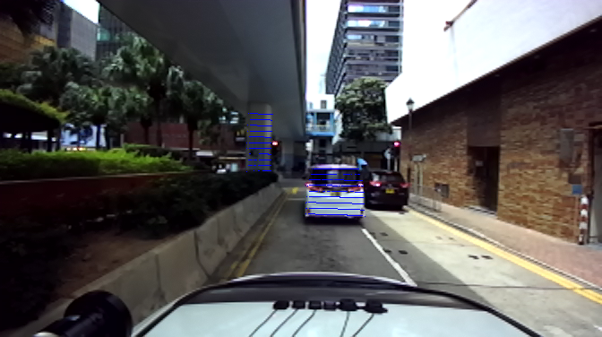
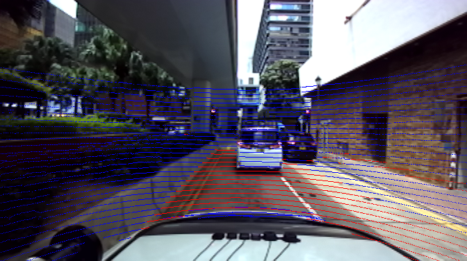

# useful tools


## projecting lidar to image

for better guessing camera_to_imu extrinsics
Convert points from lidar frame to body frame, body to camera, camera to image plane

## 1 build and results
```bash
mkdir build&&cd build
cmake ..
make
./lidar2image
```

project the pillar and car only
<p align="center">
  
</p>

project all the points in a frame (red: rough ground points)
<p align="center">
  
</p>


## 2 adjust the camera_to_imu matrix
2.1 To adjust the R matrix, convert the R matrix to euler angles using this:
https://www.andre-gaschler.com/rotationconverter/

Then change the R matrix with new euler angles

2.2 To adjust the t vector, make sure the three numbers be negative, positive and positive according to the design drawing of the sensors. 


## 3 Known issue
online calibration of vins could hardly work
